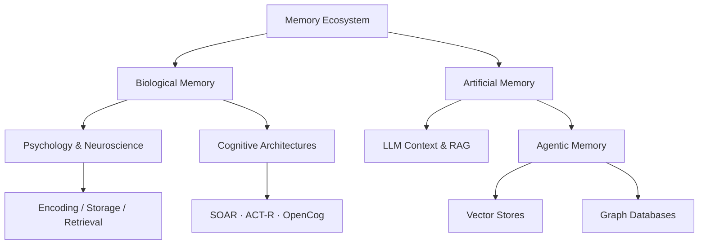

# 🧠 Awesome Memory

> A curated, high-signal list of everything **Memory** — spanning human neuroscience, cognitive psychology, AGI architectures, AI agent memory frameworks, landmark research papers, and production-ready tools.

The core goal of this repository is to become the **ultimate memory mecca** — the single best starting point for anyone exploring how biological and artificial systems encode, store, retrieve, and forget information.

---

## Why This List?

Memory is the **connective tissue** of intelligence. Whether you're a neuroscientist studying hippocampal replay, an ML engineer building a long-running AI agent, or a knowledge worker designing a second brain — all roads lead back to the same fundamental question: *how do we remember what matters?*

This list cuts across disciplines so you don't have to. Each link earns its place.

---

## 🗺️ Memory Architecture

---

## 📚 Table of Contents

- [Brain Memory Research & Psychology](#-brain-memory-research--psychology)
- [AGI & Cognitive Architectures](#-agi--cognitive-architectures)
- [Agentic Memory Frameworks](#-agentic-memory-frameworks)
- [Vector & Graph Storage Solutions](#-vector--graph-storage-solutions)
- [Landmark Research Papers](#-landmark-research-papers)
- [Courses & Tutorials](#-courses--tutorials)
- [Blogs & Newsletters](#-blogs--newsletters)
- [Memory Apps & Tools](#-memory-apps--tools)
- [Contributing](#contributing)

---

## 🧠 Brain Memory Research & Psychology

*Deep dives into human cognition, behavioral psychology, and how biological systems store short-term and long-term memory.*

- [Atkinson-Shiffrin Memory Model](https://en.wikipedia.org/wiki/Atkinson%E2%80%93Shiffrin_memory_model) — Foundational multi-store model: sensory → short-term → long-term memory.
- [Baddeley's Model of Working Memory](https://en.wikipedia.org/wiki/Baddeley%27s_model_of_working_memory) — The dominant framework for working memory: phonological loop, visuospatial sketchpad, central executive.
- [Neuroscience of Storage](https://qbi.uq.edu.au/brain-basics/memory/where-are-memories-stored) — How synaptic plasticity, LTP, and engrams form biology's hard drive.
- [Hippocampal Indexing Theory](https://pubmed.ncbi.nlm.nih.gov/20346399/) — How the hippocampus acts as an index for cortical memories.
- [The Forgetting Curve](https://en.wikipedia.org/wiki/Forgetting_curve) — Ebbinghaus's hypothesis on the decline of memory retention over time.
- [Human Memory Models](https://en.wikipedia.org/wiki/Memory_model_(psychology)) — Overview of competing theories of working memory and consolidation.
- [Brain Memory Research Papers →](./papers/brain-memory/README.md) — Synaptic plasticity, engrams, consolidation, neuroimaging, and key experiments.
- [Cognitive Psychology Papers →](./papers/psychology/README.md) — Classic experiments, forgetting mechanisms, and applied models.

---

## 🤖 AGI & Cognitive Architectures

*Approaching Artificial General Intelligence requires robust, flexible, and scalable memory paradigms built on cognitive science.*

- [SOAR Architecture](https://soar.eecs.umich.edu/) — General cognitive architecture emphasizing chunking and procedural learning.
- [ACT-R](http://act-r.psy.cmu.edu/) — Adaptive Control of Thought-Rational; models human performance with declarative and procedural memory subsystems.
- [OpenCog](https://opencog.org/) — Open-source AGI framework with hypergraph-based knowledge representation.
- [LIDA (Learning Intelligent Distribution Agent)](https://ccrg.cs.memphis.edu/tutorial/index.html) — Grounded in Global Workspace Theory; full perception-action loop with multiple memory types.
- [CLARION](http://www.cogsci.rpi.edu/~rsun/clarion.html) — Dual-process model distinguishing implicit vs. explicit cognitive processes.
- [Sigma](https://ict.usc.edu/research/projects/sigma/) — Unified cognitive architecture integrating perception, cognition, and action under a single graphical model.
- [Cognitive Architectures for Prototyping AGI (Survey)](https://arxiv.org/abs/2312.11520) — Comprehensive survey bridging cognitive science foundations and modern AGI research.

---

## 🕵️ Agentic Memory Frameworks

*How modern AI agents preserve context across sessions, build knowledge graphs, and act autonomously.*

- [Letta (fka MemGPT)](https://github.com/letta-ai/letta) — LLMs as operating systems with tiered virtual memory (in-context, external, archival).
- [Mem0](https://github.com/mem0ai/mem0) — Production-ready memory layer for personalized AI; hybrid vector + graph + key-value store.
- [Zep](https://github.com/getzep/zep) — Fast, scalable temporal memory for AI apps; extracts facts and knowledge graphs from conversations.
- [Honcho](https://github.com/plastic-labs/honcho) — User-centric memory and identity layer for AI agents.
- [Cognee](https://github.com/topoteretes/cognee) — Knowledge engine that builds semantic memory graphs from unstructured data.
- [LangChain Memory](https://python.langchain.com/docs/modules/memory/) — Standardized memory primitives: Buffer, Summary, Entity, VectorStore retriever.
- [LangMem](https://github.com/langchain-ai/langmem) — Long-term memory management built for LangGraph agents.
- [LlamaIndex](https://www.llamaindex.ai/) — Data framework connecting custom data to LLMs via structured graphs and vector indices.
- [MemOS](https://github.com/MemOS-Agent/MemOS) — Memory operating system for AI; combats "digital amnesia" with persistent unified memory.
- [Agentic Memory Research Papers →](./papers/agentic-memory/README.md) — State-of-the-art research, benchmarks, and implementation patterns.

---

## 🗄️ Vector & Graph Storage Solutions

*The infrastructure layer that makes latent and structured retrieval possible.*

### Vector Databases (Semantic)

- [Chroma](https://www.trychroma.com/) — Open-source embedding database; developer-first, runs locally or in cloud.
- [Faiss](https://github.com/facebookresearch/faiss) — Facebook AI Similarity Search library for dense vector clustering at scale.
- [Milvus](https://milvus.io/) — Cloud-native, highly scalable open-source vector database.
- [pgvector](https://github.com/pgvector/pgvector) — Open-source vector extension for PostgreSQL; zero new infra if you're already on Postgres.
- [Pinecone](https://www.pinecone.io/) — Serverless managed vector DB optimized for high-throughput production retrieval.
- [Qdrant](https://qdrant.tech/) — High-performance, Rust-based vector database with advanced filtering.
- [Weaviate](https://weaviate.io/) — AI-native database with built-in hybrid search and generative modules.

### Graph Databases (Relational)

- [FalkorDB](https://github.com/FalkorDB/FalkorDB) — Low-latency graph DB optimized for knowledge graph queries in AI applications.
- [GraphRAG (Microsoft)](https://github.com/microsoft/graphrag) — Structured knowledge graph extraction enabling community-level RAG insights.
- [Memgraph](https://memgraph.com/) — In-memory graph DB optimized for streaming and real-time analytics.
- [Neo4j](https://neo4j.com/) — Leading graph database with Cypher query language; widely used for knowledge graphs.

---

## 📄 Landmark Research Papers

*The foundational papers that shaped modern understanding of artificial memory, context optimization, and agentic workflows.*

| Paper | Year | Key Contribution |
|-------|------|-----------------|
| [Attention Is All You Need](https://arxiv.org/abs/1706.03762) | 2017 | Transformer architecture — the context window as working memory |
| [RETRO: Improving Language Models by Retrieving from Trillions of Tokens](https://arxiv.org/abs/2112.04426) | 2021 | Retrieval-enhanced Transformer; kNN memory over 2T tokens |
| [Generative Agents: Interactive Simulacra of Human Behavior](https://arxiv.org/abs/2304.03442) | 2023 | Memory streams, reflection, and planning in LLM agents |
| [Reflexion: Language Agents with Verbal Reinforcement Learning](https://arxiv.org/abs/2303.11366) | 2023 | Self-reflection as episodic memory for agent improvement |
| [MemoryBank: Enhancing LLMs with Long-Term Memory](https://arxiv.org/abs/2305.10250) | 2023 | Memory updating with Ebbinghaus-inspired forgetting curve |
| [Voyager: An Open-Ended Embodied Agent with LLMs](https://arxiv.org/abs/2305.16291) | 2023 | Skill library as evolving procedural memory |
| [MemGPT: Towards LLMs as Operating Systems](https://arxiv.org/abs/2310.08560) | 2023 | Infinite context via tiered virtual memory |
| [Lost in the Middle: How LLMs Use Long Contexts](https://arxiv.org/abs/2307.03172) | 2023 | Primacy/recency bias in attention; key insight for memory system design |
| [AI-native Memory: A Pathway from LLMs Towards AGI](https://arxiv.org/abs/2402.11666) | 2024 | Evolving from retrieval-augmented to reasoning-integrated memory |
| [HippoRAG: Neurologically Inspired Long-Term Memory for LLMs](https://arxiv.org/abs/2405.14831) | 2024 | Hippocampus-inspired retrieval combining knowledge graphs + dense vectors |
| [Memory in the Age of AI Agents: A Survey](https://arxiv.org/abs/2404.13501) | 2024 | Comprehensive taxonomy of agent memory types and frameworks |
| [Mem0: Production-Ready AI Agents with Scalable Long-Term Memory](https://arxiv.org/abs/2504.19413) | 2025 | Hybrid vector + graph + key-value memory at production scale |

See also: [LLM Memory Research →](./papers/llm-memory/README.md) · [Agentic Memory Research →](./papers/agentic-memory/README.md)

---

## 🎓 Courses & Tutorials

*Structured learning paths for both the neuroscience and engineering sides of memory.*

### Neuroscience & Cognitive Science

- [MIT 9.13 — The Human Brain (OpenCourseWare)](https://ocw.mit.edu/courses/9-13-the-human-brain-spring-2019/) — Nancy Kanwisher's landmark course on brain regions and memory systems.
- [MIT 9.01 — Introduction to Neuroscience](https://ocw.mit.edu/courses/9-01-introduction-to-neuroscience-fall-2007/) — Foundational neuroscience covering memory encoding and retrieval.
- [Coursera: Computational Neuroscience](https://www.coursera.org/learn/computational-neuroscience) — University of Washington; covers neural coding and memory models.
- [Huberman Lab — Using Failures, Movement & Balance to Learn Faster](https://www.hubermanlab.com/episode/using-failures-movement-and-balance-to-learn-faster) — Practical neuroscience of memory consolidation and sleep.

### AI & Agents

- [DeepLearning.AI — Building and Evaluating Advanced RAG](https://learn.deeplearning.ai/courses/building-evaluating-advanced-rag) — Retrieval augmentation and hybrid memory architectures.
- [DeepLearning.AI — Multi-Agent Systems with crewAI](https://learn.deeplearning.ai/courses/multi-ai-agent-systems-with-crewai) — Includes shared agent memory patterns.
- [LangChain Academy — Introduction to LangGraph](https://academy.langchain.com/courses/intro-to-langgraph) — Stateful, memory-enabled graph-based agents.
- [mem0 Quickstart](https://docs.mem0.ai/quickstart) — 5-minute guide to adding long-term memory to any LLM application.

---

## 📰 Blogs & Newsletters

*High-quality writing on memory research, AI agents, and knowledge management.*

### AI / Agents

- [Lilian Weng — LLM-powered Autonomous Agents](https://lilianweng.github.io/posts/2023-06-23-agent/) — Comprehensive breakdown of planning, memory types, and tool use in agents.
- [Chip Huyen — Building LLM Applications for Production](https://huyenchip.com/2023/04/11/llm-engineering.html) — Practical context management and memory considerations.
- [Simon Willison's Weblog](https://simonwillison.net/) — Frequent, high-signal posts on LLMs, agents, and tooling.
- [The Sequence](https://thesequence.substack.com/) — Weekly newsletter covering AI research including agent memory advances.

### Neuroscience & Cognition

- [Transmitter (Nature Neuroscience)](https://www.nature.com/collections/transmitter) — Short-form neuroscience writing from Nature editors.
- [Psychology Today — Memory](https://www.psychologytoday.com/intl/basics/memory) — Accessible coverage of cognitive psychology research.
- [BrainFacts.org](https://www.brainfacts.org/) — Public neuroscience resource from the Kavli Foundation.

### Knowledge Management

- [Forte Labs Blog](https://fortelabs.com/blog/) — Building a Second Brain, PARA method, and personal knowledge workflows.
- [Zettelkasten.de](https://zettelkasten.de/posts/overview/) — Deep resources on the Zettelkasten method for long-term knowledge retention.

---

## 🛠️ Memory Apps & Tools

*Open-source projects and tools putting these theories into production.*

- [Open Source Apps Index →](./apps/open-source/README.md) — Full directory: AI memory layers, PKM apps, spaced repetition tools, vector DBs, graph DBs, browser extensions, mobile apps, and comparison matrices.

**Quick links:**

| Category | Tools |
|----------|-------|
| AI Memory Layers | [Mem0](https://github.com/mem0ai/mem0) · [Zep](https://github.com/getzep/zep) · [Letta](https://github.com/letta-ai/letta) · [Honcho](https://github.com/plastic-labs/honcho) · [Cognee](https://github.com/topoteretes/cognee) |
| PKM | [Obsidian](https://obsidian.md) · [Logseq](https://logseq.com) · [Foam](https://foambubble.github.io/foam/) · [RemNote](https://remnote.com) |
| Spaced Repetition | [Anki](https://ankiweb.net) · [FSRS](https://github.com/open-spaced-repetition) · [SuperMemo](https://supermemo.com) |
| Vector DBs | [Chroma](https://www.trychroma.com/) · [Qdrant](https://qdrant.tech/) · [Weaviate](https://weaviate.io/) · [pgvector](https://github.com/pgvector/pgvector) |
| Graph DBs | [Neo4j](https://neo4j.com/) · [Memgraph](https://memgraph.com/) · [FalkorDB](https://github.com/FalkorDB/FalkorDB) |

---

## Contributing

Contributions are welcome! Please read [CONTRIBUTING.md](CONTRIBUTING.md) before opening a pull request.

Quick rules:
- Every link must point to a specific, working resource (no paywalled landing pages, no bare `arxiv.org/`)
- New entries go in alphabetical order within their section
- Prefer primary sources (official repos, arxiv, project docs) over blog summaries
- Include a short, factual description for each entry

---

*See something missing? Open a PR.*
