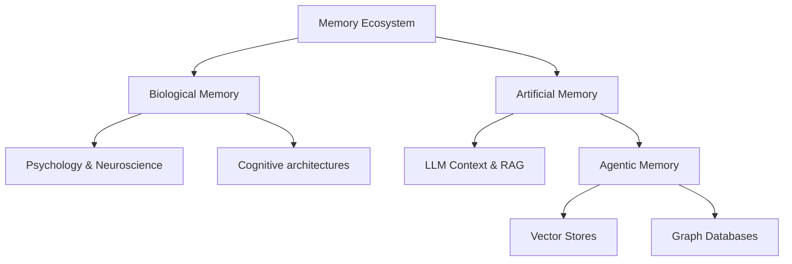

# 🧠 Awesome Memory Repo

A curated, kickass list of all things Memory. The core goal of this repository is to become the ultimate memory mecca—encompassing human brain research, AGI, AI agents, key papers, and memory-based applications.

## 🗺️ Memory Architecture

## 📚 Table of Contents
- [Brain Memory Research & Psychology](#-brain-memory-research--psychology)
- [AGI & Cognitive Architectures](#-agi--cognitive-architectures)
- [Agentic Memory](#-agentic-memory)
- [Key Papers](#-key-papers)
- [Memory Apps & Tools](#-memory-apps--tools)

---

### 🧠 Brain Memory Research & Psychology
*Deep dives into human cognition, behavioral psychology, and how biological systems store short-term and long-term memory.*
- [Human Memory Models](./papers/psychology/README.md) - Theories of working memory and consolidation.
- [Neuroscience of Storage](#) - Synaptic plasticity and engrams.

### 🤖 AGI & Cognitive Architectures
*Approaching Artificial General Intelligence requires robust, flexible, and scalable memory paradigms.*
- [SOAR Architecture](#) - A general cognitive architecture for AI.
- [ACT-R](#) - Adaptive Control of Thought-Rational.

### 🕵️ Agentic Memory
*How AI agents preserve context across sessions, build knowledge graphs, and retrieve specific facts.*
- [Vector DBs (Pinecone, Milvus, Weaviate)](#) - Semantic knowledge storage.
- [Graph RAG (Neo4j, Memgraph)](#) - Relational memory and structured thought.
- [Agentic Memory Patterns](./papers/agentic-memory/README.md) - Core workflows.

### 📄 Key Papers
*The foundational papers that shaped our modern understanding of artificial memory.*
- [Attention Is All You Need] - The birth of the Transformer context window.
- [Generative Agents: Interactive Simulacra of Human Behavior] - Memory streams in LLMs.
- [MemGPT: Towards LLMs as Operating Systems] - Infinite context management via tiered memory systems.

### 🛠️ Memory Apps & Tools
*Open-source projects and kickass tools doing memory right.*
- [Open Source Apps](./apps/open-source/README.md)
- [Nexus Prime Memory Module](#) - Integrated local intelligence.

---
*Contributions are always welcome! Feel free to open a PR to add your favorite memory research, tool, or paper.*
