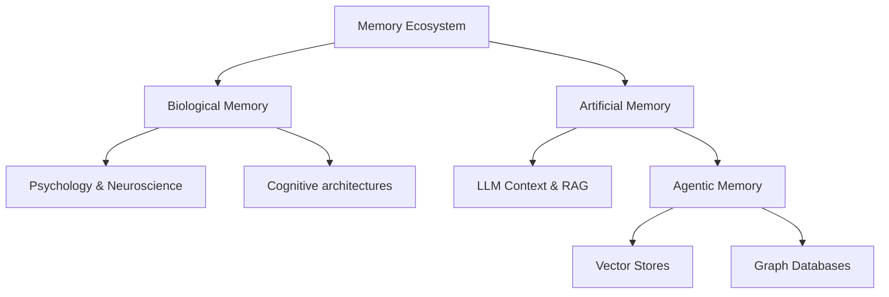

# 🧠 Awesome Memory Repo

A curated, kickass list of all things Memory. The core goal of this repository is to become the ultimate memory mecca—encompassing human brain research, AGI, AI agents, key papers, and memory-based applications.

## 🗺️ Memory Architecture

## 📚 Table of Contents
- [Brain Memory Research & Psychology](#-brain-memory-research--psychology)
- [AGI & Cognitive Architectures](#-agi--cognitive-architectures)
- [Agentic Memory](#-agentic-memory)
- [Key Papers](#-key-papers)
- [Memory Apps & Tools](#-memory-apps--tools)

---

### 🧠 Brain Memory Research & Psychology
*Deep dives into human cognition, behavioral psychology, and how biological systems store short-term and long-term memory.*
- [Human Memory Models](https://en.wikipedia.org/wiki/Memory_model_(psychology)) - Theories of working memory and consolidation.
- [Neuroscience of Storage](https://qbi.uq.edu.au/brain-basics/memory/where-are-memories-stored) - Synaptic plasticity and engrams.

### 🤖 AGI & Cognitive Architectures
*Approaching Artificial General Intelligence requires robust, flexible, and scalable memory paradigms.*
- [SOAR Architecture](https://soar.eecs.umich.edu/) - A general cognitive architecture for AI.
- [ACT-R](http://act-r.psy.cmu.edu/) - Adaptive Control of Thought-Rational.
- [Cognitive Architectures for Prototyping AGI](https://arxiv.org/abs/2312.11520) - Survey of foundational models for intelligence.

### 🕵️ Agentic Memory
*How AI agents preserve context across sessions, build knowledge graphs, and retrieve specific facts.*
- [Vector DBs (Pinecone, Milvus, Weaviate)](https://www.pinecone.io/) - Semantic knowledge storage.
- [Graph RAG (Neo4j, Memgraph)](https://neo4j.com/) - Relational memory and structured thought.
- [Agentic Memory Patterns](./papers/agentic-memory/README.md) - Core workflows.
- [Memory in the Age of AI Agents: A Survey](https://arxiv.org/abs/2404.13501) - Comprehensive taxonomy and landscape of agent memory.
- [MemOS: A Memory OS for AI System](https://github.com/MemOS-Agent/MemOS) - Combating "digital amnesia" with a dedicated memory OS.

### 📄 Key Papers
*The foundational papers that shaped our modern understanding of artificial memory.*
- [Attention Is All You Need](https://arxiv.org/abs/1706.03762) - The birth of the Transformer context window.
- [Generative Agents: Interactive Simulacra of Human Behavior](https://arxiv.org/abs/2304.03442) - Memory streams in LLMs.
- [MemGPT: Towards LLMs as Operating Systems](https://arxiv.org/abs/2310.08560) - Infinite context management via tiered memory systems.
- [AI-native Memory: A Pathway from LLMs Towards AGI](https://arxiv.org/abs/2402.11666) - Evolving from mere retrieval to core reasoning storage.

### 🛠️ Memory Apps & Tools
*Open-source projects and kickass tools doing memory right.*
- [Open Source Apps](./apps/open-source/README.md)
- [Nexus Prime Memory Module](https://www.npmjs.com/package/nexus-prime) - Integrated local intelligence.
- [LangChain Memory](https://python.langchain.com/docs/modules/memory/) - Standardized memory primitives for LLM chains.
- [LlamaIndex](https://www.llamaindex.ai/) - Data framework for connecting custom data to LLMs.

---
*Contributions are always welcome! Feel free to open a PR to add your favorite memory research, tool, or paper.*
