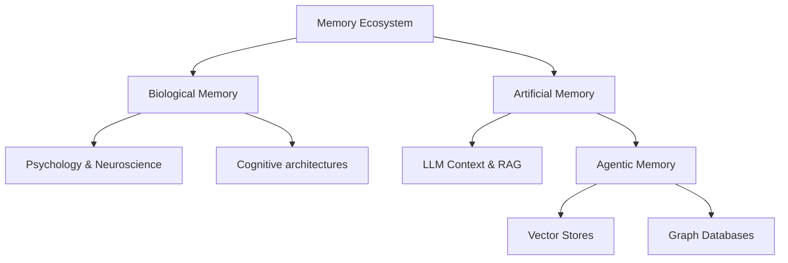

# 🧠 Awesome Memory Repo

A curated, kickass list of all things Memory. The core goal of this repository is to become the ultimate memory mecca—encompassing human brain research, AGI, AI agents, key papers, and memory-based applications.

## 🗺️ Memory Architecture

## 📚 Table of Contents
- [Brain Memory Research & Psychology](#-brain-memory-research--psychology)
- [AGI & Cognitive Architectures](#-agi--cognitive-architectures)
- [Agentic Memory](#-agentic-memory)
- [Key Papers](#-key-papers)
- [Memory Apps & Tools](#-memory-apps--tools)

---

### 🧠 Brain Memory Research & Psychology
*Deep dives into human cognition, behavioral psychology, and how biological systems store short-term and long-term memory.*
- [Human Memory Models](https://en.wikipedia.org/wiki/Memory_model_(psychology)) - Theories of working memory and consolidation.
- [Neuroscience of Storage](https://qbi.uq.edu.au/brain-basics/memory/where-are-memories-stored) - Synaptic plasticity and engrams.

### 🧠 Brain Memory Research & Psychology
*Deep dives into human cognition, behavioral psychology, and how biological systems store short-term and long-term memory.*
- [Atkinson-Shiffrin Memory Model](https://en.wikipedia.org/wiki/Atkinson%E2%80%93Shiffrin_memory_model) - Foundational multi-store model of memory.
- [Baddeley's Model of Working Memory](https://en.wikipedia.org/wiki/Baddeley%27s_model_of_working_memory) - The dominant framework for understanding working memory.
- [Neuroscience of Storage](https://qbi.uq.edu.au/brain-basics/memory/where-are-memories-stored) - How synaptic plasticity, LTP (Long-Term Potentiation), and engrams formulate biology's hard drive.
- [Hippocampal Indexing Theory](https://pubmed.ncbi.nlm.nih.gov/20346399/) - How the hippocampus acts as an index for cortical memories.
- [The Forgetting Curve](https://en.wikipedia.org/wiki/Forgetting_curve) - Ebbinghaus's hypothesis on the decline of memory retention in time.

### 🤖 AGI & Cognitive Architectures
*Approaching Artificial General Intelligence requires robust, flexible, and scalable memory paradigms built on cognitive science.*
- [SOAR Architecture](https://soar.eecs.umich.edu/) - A general cognitive architecture for AI, heavily emphasizing chunking and learning.
- [ACT-R](http://act-r.psy.cmu.edu/) - Adaptive Control of Thought-Rational. Models human performance line-by-line.
- [OpenCog](https://opencog.org/) - An open-source framework for AGI aiming at synergistic intelligence.
- [LIDA (Learning Intelligent Distribution Agent)](https://ccrg.cs.memphis.edu/tutorial/index.html) - Grounded in Global Workspace Theory.
- [CLARION](http://www.cogsci.rpi.edu/~rsun/clarion.html) - Focuses on the distinction between implicit and explicit cognitive processes.
- [Cognitive Architectures for Prototyping AGI (Survey)](https://arxiv.org/abs/2312.11520) - Comprehensive survey of foundational models for intelligence.

### 🕵️ Agentic Memory Frameworks
*How modern AI agents preserve context across sessions, build knowledge graphs, and act autonomously.*
- [MemGPT](https://memgpt.ai/) - (Now Letta) Towards LLMs as Operating Systems with tiered virtual memory.
- [Mem0](https://github.com/mem0ai/mem0) - The memory layer for personalized AI assistants.
- [Zep](https://github.com/getzep/zep) - Fast, scalable memory for AI applications.
- [LangChain Memory](https://python.langchain.com/docs/modules/memory/) - Standardized memory primitives (Buffer, Summary, Entity).
- [LlamaIndex](https://www.llamaindex.ai/) - Core data framework for connecting custom data to LLMs via structured graphs/vectors.
- [Agentic Memory Patterns](./papers/agentic-memory/README.md) - Best practices and workflows for agent loops.
- [MemOS: A Memory OS for AI System](https://github.com/MemOS-Agent/MemOS) - Combating "digital amnesia" with a dedicated memory OS.

### 🗄️ Vector & Graph Storage Solutions
*The infrastructure layer that makes latent and structured retrieval possible.*
**Vector Databases (Semantic)**
- [Pinecone](https://www.pinecone.io/) - Serverless vector DB for high-performance retrieval.
- [Milvus](https://milvus.io/) - Open-source, highly scalable vector database.
- [Weaviate](https://weaviate.io/) - AI-native database with built-in modules for hybrid search.
- [Qdrant](https://qdrant.tech/) - High-performance, Rust-based vector database.
- [Chroma](https://www.trychroma.com/) - The open-source embedding database for AI applications.
- [Faiss](https://github.com/facebookresearch/faiss) - Facebook AI Similarity Search for dense vector clustering.

**Graph Databases (Relational)**
- [Neo4j](https://neo4j.com/) - The world's leading Graph Database.
- [Memgraph](https://memgraph.com/) - In-memory graph database optimized for streaming data.
- [GraphRAG (Microsoft)](https://github.com/microsoft/graphrag) - Accelerating RAG using structured knowledge graphs for global insights.

### 📄 Landmark Research Papers
*The foundational research papers that shaped our modern understanding of artificial memory, context optimization, and agentic workflows.*
- [Attention Is All You Need (2017)](https://arxiv.org/abs/1706.03762) - The birth of the Transformer context window.
- [Generative Agents: Interactive Simulacra of Human Behavior (2023)](https://arxiv.org/abs/2304.03442) - Memory streams, reflection, and planning in LLMs.
- [Reflexion: Language Agents with Verbal Reinforcement Learning (2023)](https://arxiv.org/abs/2303.11366) - Self-reflection as a memory-based training methodology.
- [Voyager: An Open-Ended Embodied Agent with Large Language Models (2023)](https://arxiv.org/abs/2305.16291) - Skill library as a form of evolving procedural memory.
- [MemGPT: Towards LLMs as Operating Systems (2023)](https://arxiv.org/abs/2310.08560) - Infinite context management via tiered memory systems.
- [RETRO: Improving language models by retrieving from trillions of tokens (2021)](https://arxiv.org/abs/2112.04426) - Retrieval-Enhanced Transformer architecture.
- [Memory in the Age of AI Agents: A Survey (2024)](https://arxiv.org/abs/2404.13501) - Comprehensive taxonomy and landscape of agent memory.
- [AI-native Memory: A Pathway from LLMs Towards AGI (2024)](https://arxiv.org/abs/2402.11666) - Evolving from mere retrieval to core reasoning storage.

### 🛠️ Open-Source Memory Apps
*Kickass open-source projects putting these theories into production.*
- [Nexus Prime Memory Module](https://www.npmjs.com/package/nexus-prime) - Integrated local intelligence.
- [Open Source Apps Index](./apps/open-source/README.md) - A curated sub-directory of additional apps aiming to conquer retention.

---
*Contributions are always welcome! Feel free to open a PR to add your favorite memory research, tool, database, or paper.*
