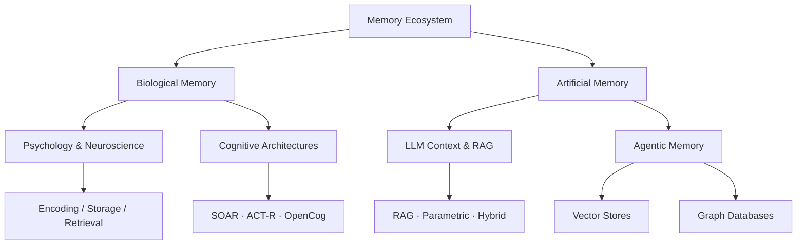

<h1>🧠 Awesome Memory</h1>

A curated, high-signal list of everything <strong>Memory</strong> — spanning human neuroscience, cognitive psychology, AGI architectures, AI agent memory frameworks, landmark research papers, surveys, benchmarks, and production-ready tools.

 

**If you find this list helpful, please give it a ⭐ — it helps others discover it.**

_Contributions are welcome! See [CONTRIBUTING.md](CONTRIBUTING.md) to add papers, tools, or fix links._

---

## Why This List?

Memory is the **connective tissue** of intelligence. Whether you're a neuroscientist studying hippocampal replay, an ML engineer building a long-running AI agent, or a knowledge worker designing a second brain — all roads lead back to the same fundamental question: *how do we remember what matters?*

This list cuts across disciplines so you don't have to. Each link earns its place — from biological memory mechanisms and cognitive science to production-ready AI memory frameworks, survey papers, and evaluation benchmarks.

---

## 🗺️ Memory Architecture

---

<strong>📚 Table of Contents</strong>

- [🆕 What's New](#-whats-new)
- [🧠 Brain Memory Research & Psychology](#-brain-memory-research--psychology)
- [🤖 AGI & Cognitive Architectures](#-agi--cognitive-architectures)
- [🕵️ Agentic Memory Frameworks](#-agentic-memory-frameworks)
- [🗄️ Vector & Graph Storage Solutions](#-vector--graph-storage-solutions)
- [📚 Surveys](#-surveys)
- [📏 Benchmarks](#-benchmarks)
- [📄 Landmark Research Papers](#-landmark-research-papers)
- [🎓 Courses & Tutorials](#-courses--tutorials)
- [📰 Blogs & Articles](#-blogs--articles)
- [🛠️ Memory Apps & Tools](#-memory-apps--tools)
- [👥 Workshops](#-workshops)
- [Contributing](#contributing)

---

## 🆕 What's New

*Recent high-signal additions — updated regularly.*

| Date | Item |
|------|------|
| Apr 2026 | [MemOS](https://arxiv.org/abs/2507.03724) — memory OS for AI agents; persistent unified memory layer |
| Apr 2026 | [OMEGA](https://github.com/omega-memory/core) — ranks #1 on LongMemEval (95.4%); 25-tool MCP server |
| Apr 2026 | [Second Me](https://arxiv.org/abs/2503.08102) — personal AI with long-term memory of your life |
| Apr 2026 | [Graphiti](https://arxiv.org/abs/2501.13956) — temporal knowledge graph engine powering Zep |
| Apr 2026 | [MAGMA](https://arxiv.org/abs/2601.03236) — multi-graph agentic memory architecture |
| Apr 2026 | [ACL 2025 Workshop: L2M2](https://sites.google.com/view/memorization-workshop) — first workshop on LLM memorization |
| Apr 2026 | [Survey on AI Memory (BAI Lab)](https://github.com/BAI-LAB/Survey-on-AI-Memory) — theories, taxonomies, evaluations |

---

## 🧠 Brain Memory Research & Psychology

*Deep dives into human cognition, behavioral psychology, and how biological systems store short-term and long-term memory.*

- [Atkinson-Shiffrin Memory Model](https://en.wikipedia.org/wiki/Atkinson%E2%80%93Shiffrin_memory_model) — Foundational multi-store model: sensory → short-term → long-term memory.
- [Baddeley's Model of Working Memory](https://en.wikipedia.org/wiki/Baddeley%27s_model_of_working_memory) — The dominant framework: phonological loop, visuospatial sketchpad, episodic buffer, central executive.
- [Neuroscience of Storage](https://qbi.uq.edu.au/brain-basics/memory/where-are-memories-stored) — How synaptic plasticity, LTP, and engrams form biology's hard drive.
- [Hippocampal Indexing Theory](https://pubmed.ncbi.nlm.nih.gov/20346399/) — How the hippocampus acts as an index for cortical memories.
- [The Forgetting Curve](https://en.wikipedia.org/wiki/Forgetting_curve) — Ebbinghaus's hypothesis on the decline of memory retention over time.
- [Human Memory Models](https://en.wikipedia.org/wiki/Memory_model_(psychology)) — Overview of competing theories of working memory and consolidation.
- [Towards Large Language Models with Human-Like Episodic Memory](https://www.cell.com/trends/cognitive-sciences/abstract/S1364-6613(25)00179-2) — *Trends in Cognitive Sciences* 2025; mapping biological episodic memory onto LLM agent architectures.
- [Brain Memory Research Papers →](./papers/brain-memory/README.md) — Synaptic plasticity, engrams, consolidation, neuroimaging, datasets, and key experiments.
- [Cognitive Psychology Papers →](./papers/psychology/README.md) — Classic experiments, forgetting mechanisms, and applied models bridging to AI.

---

## 🤖 AGI & Cognitive Architectures

*Approaching Artificial General Intelligence requires robust, flexible, and scalable memory paradigms built on cognitive science.*

- [SOAR Architecture](https://soar.eecs.umich.edu/) — General cognitive architecture emphasizing chunking and procedural learning.
- [ACT-R](http://act-r.psy.cmu.edu/) — Adaptive Control of Thought-Rational; models human performance with declarative and procedural memory subsystems.
- [OpenCog](https://opencog.org/) — Open-source AGI framework with hypergraph-based knowledge representation.
- [LIDA (Learning Intelligent Distribution Agent)](https://ccrg.cs.memphis.edu/tutorial/index.html) — Grounded in Global Workspace Theory; full perception-action loop with multiple memory types.
- [CLARION](http://www.cogsci.rpi.edu/~rsun/clarion.html) — Dual-process model distinguishing implicit vs. explicit cognitive processes.
- [Sigma](https://ict.usc.edu/research/projects/sigma/) — Unified cognitive architecture integrating perception, cognition, and action under a single graphical model.
- [Cognitive Architectures for Prototyping AGI (Survey)](https://arxiv.org/abs/2312.11520) — Comprehensive survey bridging cognitive science foundations and modern AGI research.

---

## 🕵️ Agentic Memory Frameworks

*Production-ready tools and frameworks for building AI agents with persistent, structured memory.*

> Open-source projects ordered by maturity/adoption. Star counts are live via GitHub shields.

| Tool | Description | Stars |
|------|-------------|-------|
| [Mem0](https://mem0.ai) [[repo]](https://github.com/mem0ai/mem0) [[paper]](https://arxiv.org/abs/2504.19413) | Production-ready hybrid memory layer (vector + graph + KV) for personalized AI |  |
| [Letta (fka MemGPT)](https://letta.com) [[repo]](https://github.com/letta-ai/letta) [[paper]](https://arxiv.org/abs/2310.08560) | LLMs as operating systems; tiered virtual memory (in-context, external, archival) |  |
| [Zep / Graphiti](https://getzep.com) [[repo]](https://github.com/getzep/graphiti) [[paper]](https://arxiv.org/abs/2501.13956) | Temporal knowledge graph engine; extracts facts and relationships from conversations |  |
| [Cognee](https://cognee.ai) [[repo]](https://github.com/topoteretes/cognee) [[paper]](https://arxiv.org/abs/2505.24478) | Builds semantic memory graphs from unstructured data |  |
| [Honcho](https://honcho.dev) [[repo]](https://github.com/plastic-labs/honcho) | User-centric memory and identity layer for AI agents |  |
| [Second Me](https://home.second.me) [[repo]](https://github.com/mindverse/Second-Me) [[paper]](https://arxiv.org/abs/2503.08102) | Personal AI that builds long-term memory of your life and preferences |  |
| [MemOS](https://memos.openmem.net) [[repo]](https://github.com/MemTensor/MemOS) [[paper]](https://arxiv.org/abs/2507.03724) | Memory operating system for AI; combats "digital amnesia" with persistent unified memory |  |
| [LangMem](https://langchain-ai.github.io/langmem) [[repo]](https://github.com/langchain-ai/langmem) | Long-term memory management built for LangGraph agents |  |
| [Memobase](https://memobase.io) [[repo]](https://github.com/memodb-io/memobase) | User-profile-centric memory store for personalized AI interactions |  |
| [Hindsight](https://hindsight.vectorize.io) [[repo]](https://github.com/vectorize-io/hindsight) [[paper]](https://arxiv.org/abs/2512.12818) | Auto-learns from past interactions to improve future responses |  |
| [OMEGA](https://omegamax.co) [[repo]](https://github.com/omega-memory/core) | MCP server with 25 memory tools; ranks #1 on LongMemEval (95.4%) |  |
| [LlamaIndex](https://www.llamaindex.ai) | Data framework connecting custom data to LLMs via structured graphs and vector indices |  |
| [LangChain Memory](https://python.langchain.com/docs/modules/memory/) | Standardized memory primitives: Buffer, Summary, Entity, VectorStore retriever |  |

**See also:** [Agentic Memory Research Papers →](./papers/agentic-memory/README.md) — State-of-the-art research, benchmarks, and implementation patterns.

---

## 🗄️ Vector & Graph Storage Solutions

*The infrastructure layer that makes latent and structured retrieval possible.*

### Vector Databases

| DB | Description | Stars |
|----|-------------|-------|
| [Chroma](https://www.trychroma.com) [[repo]](https://github.com/chroma-core/chroma) | Developer-first open-source embedding DB; runs locally or in cloud |  |
| [Qdrant](https://qdrant.tech) [[repo]](https://github.com/qdrant/qdrant) | High-performance Rust-based vector DB with advanced payload filtering |  |
| [Weaviate](https://weaviate.io) [[repo]](https://github.com/weaviate/weaviate) | AI-native DB with built-in hybrid search and generative modules |  |
| [Milvus](https://milvus.io) [[repo]](https://github.com/milvus-io/milvus) | Cloud-native, highly scalable open-source vector DB |  |
| [pgvector](https://github.com/pgvector/pgvector) | Vector extension for PostgreSQL; zero new infra if you're already on Postgres |  |
| [Faiss](https://github.com/facebookresearch/faiss) | Facebook AI Similarity Search library for dense vector clustering at scale |  |
| [Pinecone](https://www.pinecone.io) | Fully managed serverless vector DB for high-throughput production retrieval | — |

### Graph Databases & Knowledge Graphs

| DB | Description | Stars |
|----|-------------|-------|
| [Neo4j](https://neo4j.com) [[repo]](https://github.com/neo4j/neo4j) | Leading graph DB with Cypher; widely used for knowledge graphs |  |
| [GraphRAG (Microsoft)](https://github.com/microsoft/graphrag) | Structured KG extraction enabling community-level RAG insights |  |
| [Memgraph](https://memgraph.com) [[repo]](https://github.com/memgraph/memgraph) | In-memory streaming graph DB |  |
| [FalkorDB](https://falkordb.com) [[repo]](https://github.com/FalkorDB/FalkorDB) | Low-latency graph DB optimized for AI knowledge graph queries |  |

---

## 📚 Surveys

*The best survey papers for understanding the memory landscape — start here before diving into specific topics.*

### 2026

| Survey | arXiv | Scope |
|--------|-------|-------|
| [Rethinking Memory Mechanisms of Foundation Agents in the Second Half](https://arxiv.org/abs/2602.06052) | 2602.06052 | Comprehensive re-evaluation of agent memory paradigms |
| [Toward Efficient Agents: Memory, Tool Learning, and Planning](https://arxiv.org/abs/2601.14192) | 2601.14192 | Unified view of efficiency across memory, tools, and planning |
| [Externalization in LLM Agents: Memory, Skills, Protocols and Harness Engineering](https://arxiv.org/abs/2604.08224) | 2604.08224 | Taxonomy of how agents externalize knowledge |
| [Survey on AI Memory: Theories, Taxonomies, Evaluations, and Emerging Trends](https://github.com/BAI-LAB/Survey-on-AI-Memory) | — | Broad theoretical + empirical survey |
| [The AI Hippocampus: How Far are We From Human Memory?](https://arxiv.org/abs/2601.09113) | 2601.09113 | Gap analysis between biological and artificial memory |
| [From Storage to Experience: Survey on the Evolution of LLM Agent Memory Mechanisms](https://www.preprints.org/manuscript/202601.0618) | — | Historical arc from simple retrieval to experiential memory |

### 2025

| Survey | arXiv | Scope |
|--------|-------|-------|
| [Memory in the Age of AI Agents](https://arxiv.org/abs/2512.13564) | 2512.13564 | Agent-centric memory taxonomy and landscape |
| [Rethinking Memory in AI: Taxonomy, Operations, Topics, and Future Directions](https://arxiv.org/abs/2505.00675) | 2505.00675 | Systematic taxonomy covering all memory operation types |
| [From Human Memory to AI Memory: Survey in the Era of LLMs](https://arxiv.org/abs/2504.15965) | 2504.15965 | Biological-to-AI mapping of memory mechanisms |
| [Cognitive Memory in Large Language Models](https://arxiv.org/abs/2504.02441) | 2504.02441 | Cognitive science lens on LLM memory capabilities |
| [Human-inspired Perspectives: A Survey on AI Long-term Memory](https://arxiv.org/abs/2411.00489) | 2411.00489 | Human memory as design inspiration for AI systems |

### 2024

| Survey | arXiv | Scope |
|--------|-------|-------|
| [A Survey on the Memory Mechanism of LLM-based Agents](https://arxiv.org/abs/2404.13501) | 2404.13501 | Comprehensive taxonomy: sensory, short-term, long-term, procedural |

**See also:** [LLM Memory Research →](./papers/llm-memory/README.md) · [Agentic Memory Research →](./papers/agentic-memory/README.md)

---

## 📏 Benchmarks

*Evaluation frameworks for measuring memory quality, long-context retention, and agent learning.*

### Text / Conversational Memory

| Benchmark | arXiv | What It Tests |
|-----------|-------|--------------|
| [BEAM: Beyond a Million Tokens](https://arxiv.org/abs/2510.27246) | 2510.27246 | Long-term memory at 1M+ token scale |
| [LongMemEval](https://arxiv.org/abs/2410.10813) [[data]](https://github.com/xiaowu0162/LongMemEval) | 2410.10813 | Chat assistants on long-term interactive memory |
| [LoCoMo](https://arxiv.org/abs/2402.17753) [[data]](https://github.com/snap-research/LoCoMo) | 2402.17753 | Very long-term conversational memory (up to 2M tokens) |
| [MemoryAgentBench](https://arxiv.org/abs/2507.05257) [[data]](https://github.com/HUST-AI-HYZ/MemoryAgentBench) | 2507.05257 | Memory via incremental multi-turn interactions |
| [PersonaMem](https://arxiv.org/abs/2504.14225) [[data]](https://github.com/bowen-upenn/PersonaMem) | 2504.14225 | Dynamic user profiling and personalized responses |
| [NoLiMa](https://arxiv.org/abs/2502.05167) [[data]](https://github.com/adobe-research/NoLiMa) | 2502.05167 | Long-context evaluation beyond literal matching |
| [MemoryBench](https://arxiv.org/abs/2510.17281) [[code]](https://github.com/LittleDinoC/MemoryBench) | 2510.17281 | Memory + continual learning in LLM systems |
| [HaluMem](https://arxiv.org/abs/2511.03506) [[code]](https://github.com/MemTensor/HaluMem) | 2511.03506 | Hallucinations in agent memory systems |
| [LongBench v2](https://arxiv.org/abs/2412.15204) [[code]](https://github.com/THUDM/LongBench) | 2412.15204 | Deep reasoning on realistic long-context multitasks |
| [∞Bench](https://arxiv.org/abs/2402.13718) [[code]](https://github.com/OpenBMB/InfiniteBench) | 2402.13718 | Long-context evaluation beyond 100K tokens |
| [HELMET](https://arxiv.org/abs/2410.02694) | 2410.02694 | How Models Handle Extended Long-form Text |

### Multimodal Memory

| Benchmark | arXiv | What It Tests |
|-----------|-------|--------------|
| [TeleEgo](https://arxiv.org/abs/2510.23981) [[code]](https://github.com/TeleAI-UAGI/TeleEgo) | 2510.23981 | Egocentric AI assistants in the wild |
| [LVBench](https://arxiv.org/abs/2406.08035) [[code]](https://github.com/zai-org/LVBench) | 2406.08035 | Extreme long video understanding |
| [Video-MME](https://arxiv.org/abs/2405.21075) [[code]](https://github.com/MME-Benchmarks/Video-MME) | 2405.21075 | Multi-modal LLM video analysis |

---

## 📄 Landmark Research Papers

*The foundational papers that shaped modern understanding of artificial memory, context optimization, and agentic workflows.*

| Paper | Year | Key Contribution |
|-------|------|-----------------|
| [Attention Is All You Need](https://arxiv.org/abs/1706.03762) | 2017 | Transformer architecture — the context window as working memory |
| [Memory Networks](https://arxiv.org/abs/1410.3916) | 2018 | External addressable memory for QA; precursor to RAG |
| [RAG: Retrieval-Augmented Generation for Knowledge-Intensive NLP](https://arxiv.org/abs/2005.11401) | 2020 | Original RAG paper — retrieval as soft external memory |
| [RETRO: Improving Language Models by Retrieving from Trillions of Tokens](https://arxiv.org/abs/2112.04426) | 2021 | kNN retrieval over 2T-token external memory corpus |
| [Generative Agents: Interactive Simulacra of Human Behavior](https://arxiv.org/abs/2304.03442) | 2023 | Memory streams, reflection, and planning in LLM agents |
| [Reflexion: Language Agents with Verbal Reinforcement Learning](https://arxiv.org/abs/2303.11366) | 2023 | Self-reflection stored as episodic memory drives improvement |
| [MemoryBank: Enhancing LLMs with Long-Term Memory](https://arxiv.org/abs/2305.10250) | 2023 | Memory updating with Ebbinghaus-inspired forgetting curve |
| [Voyager: An Open-Ended Embodied Agent with LLMs](https://arxiv.org/abs/2305.16291) | 2023 | Skill library as evolving procedural memory |
| [MemGPT: Towards LLMs as Operating Systems](https://arxiv.org/abs/2310.08560) | 2023 | Infinite context via tiered virtual memory |
| [Lost in the Middle: How LLMs Use Long Contexts](https://arxiv.org/abs/2307.03172) | 2023 | Primacy/recency bias in attention — critical for memory design |
| [HippoRAG: Neurologically Inspired Long-Term Memory for LLMs](https://arxiv.org/abs/2405.14831) | 2024 | Hippocampus-inspired graph + dense vector retrieval |
| [AI-native Memory: A Pathway from LLMs Towards AGI](https://arxiv.org/abs/2402.11666) | 2024 | From retrieval-augmented to reasoning-integrated memory |
| [Graphiti: A Temporal Knowledge Graph for LLM Agents](https://arxiv.org/abs/2501.13956) | 2025 | Bi-temporal fact extraction; powers Zep's memory graph |
| [Mem0: Production-Ready AI Agents with Scalable Long-Term Memory](https://arxiv.org/abs/2504.19413) | 2025 | Hybrid vector + graph + KV memory at production scale |
| [Titans: Learning to Memorize at Test Time](https://arxiv.org/abs/2501.00663) | 2025 | Memory as learnable test-time weights; beyond fixed context |
| [A-MEM: Agentic Memory System for LLM Agents](https://arxiv.org/abs/2502.12110) | 2025 | Zettelkasten-inspired dynamic memory linking and evolution |
| [MAGMA: Multi-Graph Based Agentic Memory Architecture](https://arxiv.org/abs/2601.03236) | 2026 | Multi-graph topology for structured agent memory |

See also: [LLM Memory Research →](./papers/llm-memory/README.md) · [Agentic Memory Research →](./papers/agentic-memory/README.md)

---

## 🎓 Courses & Tutorials

*Structured learning paths for both the neuroscience and engineering sides of memory.*

### Neuroscience & Cognitive Science

- [MIT 9.13 — The Human Brain (OpenCourseWare)](https://ocw.mit.edu/courses/9-13-the-human-brain-spring-2019/) — Nancy Kanwisher's landmark course on brain regions and memory systems.
- [MIT 9.01 — Introduction to Neuroscience](https://ocw.mit.edu/courses/9-01-introduction-to-neuroscience-fall-2007/) — Foundational neuroscience covering memory encoding and retrieval.
- [Coursera: Computational Neuroscience](https://www.coursera.org/learn/computational-neuroscience) — University of Washington; covers neural coding and memory models.
- [Huberman Lab — Using Failures, Movement & Balance to Learn Faster](https://www.hubermanlab.com/episode/using-failures-movement-and-balance-to-learn-faster) — Practical neuroscience of memory consolidation and sleep.

### AI & Agents

- [ACM SIGIR-AP 2025 Tutorial: Conversational Agents — From RAG to Long-Term Memory](https://sites.google.com/view/ltm-tutorial) [[paper]](https://dl.acm.org/doi/10.1145/3767695.3769671) — Academic deep dive into the transition from retrieval to persistent memory.
- [Daily Dose of DS — Memory Optimization for Agentic Systems](https://www.dailydoseofds.com/ai-agents-crash-course-part-15-with-implementation/) [[Part B]](https://www.dailydoseofds.com/ai-agents-crash-course-part-16-with-implementation/) [[Part C]](https://www.dailydoseofds.com/ai-agents-crash-course-part-17-with-implementation/) — Practical 3-part implementation series.
- [DeepLearning.AI — Building and Evaluating Advanced RAG](https://learn.deeplearning.ai/courses/building-evaluating-advanced-rag) — Retrieval augmentation and hybrid memory architectures.
- [DeepLearning.AI — Multi-Agent Systems with crewAI](https://learn.deeplearning.ai/courses/multi-ai-agent-systems-with-crewai) — Includes shared agent memory patterns.
- [LangChain Academy — Introduction to LangGraph](https://academy.langchain.com/courses/intro-to-langgraph) — Stateful, memory-enabled graph-based agents.
- [mem0 Quickstart](https://docs.mem0.ai/quickstart) — 5-minute guide to adding long-term memory to any LLM application.

---

## 📰 Blogs & Articles

*High-quality writing on memory research, AI agents, and knowledge management.*

### AI / Agents

- [Lilian Weng — LLM-powered Autonomous Agents](https://lilianweng.github.io/posts/2023-06-23-agent/) — Comprehensive breakdown of planning, memory types, and tool use in agents.
- [Survey of AI Agent Memory Frameworks](https://www.graphlit.com/blog/survey-of-ai-agent-memory-frameworks) — Practical comparison of production memory frameworks.
- [Mastering LLM Memory: A Comprehensive Guide](https://www.strongly.ai/blog/mastering-llm-memory-a-comprehensive-guide.html) — Engineering-focused guide to memory system design.
- [Chip Huyen — Building LLM Applications for Production](https://huyenchip.com/2023/04/11/llm-engineering.html) — Practical context management and memory considerations.
- [Simon Willison's Weblog](https://simonwillison.net/) — Frequent, high-signal posts on LLMs, agents, and tooling.
- [The Sequence](https://thesequence.substack.com/) — Weekly newsletter covering AI research including agent memory advances.

### Neuroscience & Cognition

- [Transmitter (Nature Neuroscience)](https://www.nature.com/collections/transmitter) — Short-form neuroscience writing from Nature editors.
- [Psychology Today — Memory](https://www.psychologytoday.com/intl/basics/memory) — Accessible coverage of cognitive psychology research.
- [BrainFacts.org](https://www.brainfacts.org/) — Public neuroscience resource from the Kavli Foundation.

### Knowledge Management

- [Forte Labs Blog](https://fortelabs.com/blog/) — Building a Second Brain, PARA method, and personal knowledge workflows.
- [Zettelkasten.de](https://zettelkasten.de/posts/overview/) — Deep resources on the Zettelkasten method for long-term knowledge retention.

---

## 🛠️ Memory Apps & Tools

*Open-source projects and tools putting these theories into production.*

- [Open Source Apps Index →](./apps/open-source/README.md) — Full directory: AI memory layers, PKM apps, spaced repetition tools, vector DBs, graph DBs, browser extensions, mobile apps, and comparison matrices.

**Quick reference:**

| Category | Tools |
|----------|-------|
| AI Memory Layers | [Mem0](https://github.com/mem0ai/mem0) · [Zep/Graphiti](https://github.com/getzep/graphiti) · [Letta](https://github.com/letta-ai/letta) · [Honcho](https://github.com/plastic-labs/honcho) · [Cognee](https://github.com/topoteretes/cognee) · [Second Me](https://github.com/mindverse/Second-Me) |
| PKM | [Obsidian](https://obsidian.md) · [Logseq](https://logseq.com) · [Foam](https://foambubble.github.io/foam/) · [RemNote](https://remnote.com) |
| Spaced Repetition | [Anki](https://ankiweb.net) · [FSRS](https://github.com/open-spaced-repetition) · [SuperMemo](https://supermemo.com) |
| Vector DBs | [Chroma](https://www.trychroma.com/) · [Qdrant](https://qdrant.tech/) · [Weaviate](https://weaviate.io/) · [pgvector](https://github.com/pgvector/pgvector) |
| Graph DBs | [Neo4j](https://neo4j.com/) · [Memgraph](https://memgraph.com/) · [FalkorDB](https://github.com/FalkorDB/FalkorDB) |

---

## 👥 Workshops

*Academic workshops dedicated to memory in AI systems.*

### 2025

- [ACL 2025 — First Workshop on Large Language Model Memorization (L2M2)](https://sites.google.com/view/memorization-workshop) [[proceedings]](https://aclanthology.org/volumes/2025.l2m2-1/) — Covers memorization, privacy, and controlled recall in LLMs.
- [ACM SIGIR-AP 2025 Tutorial: Conversational Agents — From RAG to Long-Term Memory](https://sites.google.com/view/ltm-tutorial) [[paper]](https://dl.acm.org/doi/10.1145/3767695.3769671) — Full tutorial with companion code.

---

## Contributing

Contributions are welcome! Please read [CONTRIBUTING.md](CONTRIBUTING.md) before opening a pull request.

Quick rules:
- Every link must point to a specific, working resource — no bare `arxiv.org/`, no paywalled landing pages
- New entries go in alphabetical order within their section
- Prefer primary sources (official repos, arXiv, project docs) over blog summaries
- Include a short, factual description for each entry

---

## ⭐ Star History

<a href="https://star-history.com/#sir-ad/awesome-memory&Date">
  <picture>
    <source media="(prefers-color-scheme: dark)" srcset="https://api.star-history.com/svg?repos=sir-ad/awesome-memory&type=Date&theme=dark" />
    <source media="(prefers-color-scheme: light)" srcset="https://api.star-history.com/svg?repos=sir-ad/awesome-memory&type=Date" />
    
  </picture>
</a>

---

**Found this useful? Give it a ⭐ and share it.**

Made with ❤️ for the memory research and engineering community.

*See something missing? [Open a PR](https://github.com/sir-ad/awesome-memory/pulls).*

